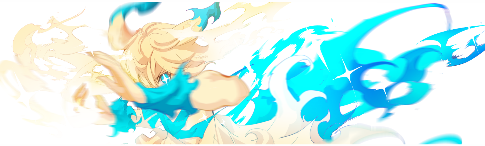

[English](./README.md) | 简体中文

<div align="center">
<!-- 标题 -->

<h1 align="center">
  - RPGMVP2PNG - 
</h1>

<!-- star数, fork数, pulls数, issues数, contributors数, 开源协议 -->
<a href="https://github.com/DrRyanHuang/rpgmvp2png/stargazers"></a>
<a href="https://github.com/DrRyanHuang/rpgmvp2png/network/members"></a>
<br/>
<a href="https://github.com/DrRyanHuang/rpgmvp2png/pulls"></a>
<a href="https://github.com/DrRyanHuang/rpgmvp2png/issues"></a>
<a href="https://github.com/DrRyanHuang/rpgmvp2png/graphs/contributors"></a>
<a href="https://github.com/DrRyanHuang/rpgmvp2png/blob/master/LICENSE"></a>


<!-- logo -->
 </img>
<br/>
<i>对这个项目感兴趣的话，可以 fork 一下并修改</i>🌟

</div>


本项目提供了 .rpgmvp 文件转化为 .png 文件的 Python 脚本和 HTML 文件。📜

rpgmvp2png.py 脚本将 RPG Maker MV 的 .rpgmvp 文件转化为 .png 文件。🔓🖼️

转换单个 .rpgmvp 文件, 请使用以下命令:


```
python rpgmvp2png.py examples/Fire1.rpgmvp out.png
```
该命令将 examples/Fire1.rpgmvp 文件转化并保存为 out.png。🚀

使用以下命令，可以递归地将该目录中的 .rpgmvp 文件转化为 .png 文件:

```
python rpgmvp2png.py examples
```

该命令将 examples 目录中的所有 .rpgmvp 文件进行转化, 并在当前目录下创建一个与原始目录结构相同的目录。📂✨

rpgmvp2png.html 文件是将 .rpgmvp文件转化为 .png 的网页工具。🌐可以直接在[这里](https://drryanhuang.github.io/rpgmvp2png/rpgmvp2png.html)使用


使用方法 🛠️

- 选择是否将转化后的图像打包为 zip 下载。
- 在网页上选择一个或多个.rpgmvp文件。
- 如果选择了打包下载选项,转化完成后会自动下载一个包含所有转化图像的zip文件。
- 如果没有选择打包下载选项,转化后的图像将显示在网页上,可以单独保存每个图像。

注意事项 📝

- 确保上传的文件是RPG Maker MV的.rpgmvp文件。其他格式的文件可能无法正确转化。⚠️
- 转化大量文件或大文件可能需要一些时间。请耐心等待。⏳
- 转化后的图像是临时存储在浏览器中的。关闭网页或清除浏览器缓存可能会导致图像丢失。请及时保存所需的图像。💾❗
- 提供的代码仅供参考和学习使用。请不要从事任何非法活动。🙏❌


如果您有任何问题或建议,请随时在GitHub Issue 区留言。非常感谢您的反馈!😊👍